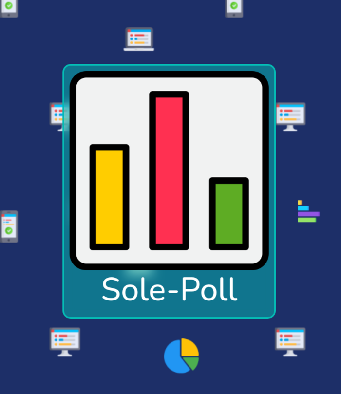

# Sole-Poll

## Table of Contents
- [Sole-Poll](#sole-poll)
  - [Table of Contents](#table-of-contents)
  - [General Info](#general-info)
  - [Getting Started](#getting-started)
  - [Usage](#usage)
  - [Technologies](#technologies)
  - [Credits](#credits)
  - [Next Steps](#next-steps)

## General Info
This project is a Django Application that allows users to create simple polls that anyone can vote on. Your "Sole" location to create polls.

## Getting Started
- [Visit here](https://sole-poll.fly.dev/)
- [Project Planning Trello Board](https://trello.com/b/scCt6DyH/sole-poll)

## Usage
* **Create Polls**
* **Vote on the results**
* **Polls can have expiration dates**
* **Create accounts and login**
* **Authenticated users can see a history of their own polls**
* **Update and delete polls, add more options if needed**
  
## Technologies
* 
* 
* 
* 
* 
* 
* 

* 
  
  *Fly.io*

## Credits
- Favicon and home logo created by srip - [Flaticon](https://www.flaticon.com/free-icons/poll)
- Chart images from [Image-Charts API](https://documentation.image-charts.com/)

## Next Steps
* Add ability to remove options on a poll
* Allow users to create QR codes for their polls